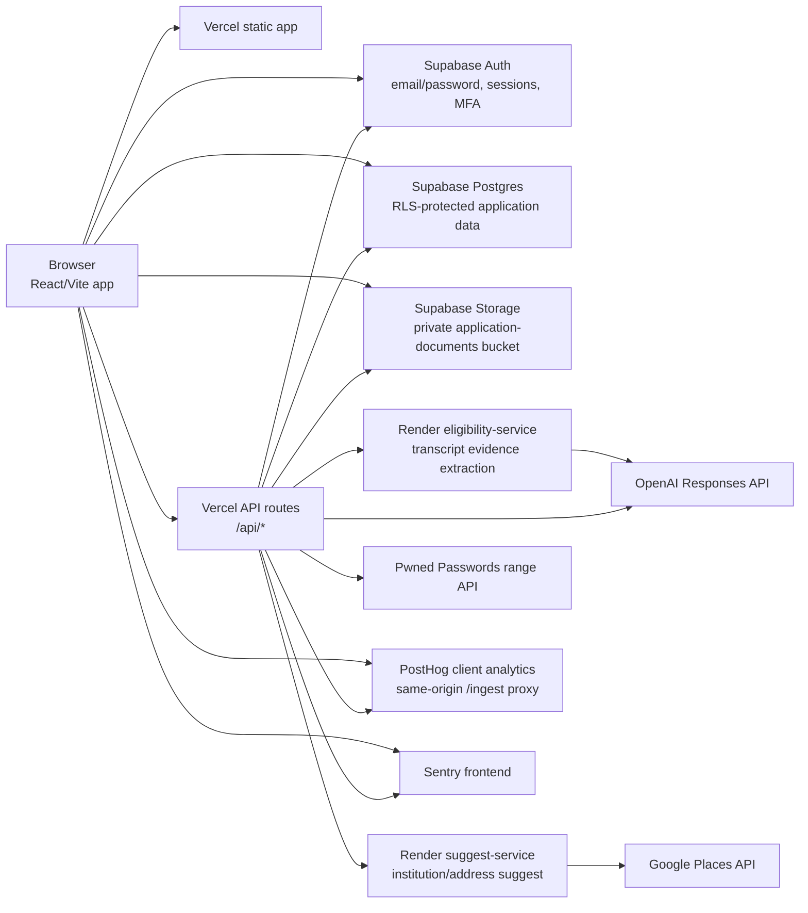

# Historical Systems Architecture Review - Applications Runtime

> **Historical snapshot.** This review records findings as observed on 2026-07-06.
> It is not current implementation guidance. See
> [`../system-context.md`](../system-context.md) for current ownership and boundaries.

Review date: 2026-07-06

Scope: Applications runtime system and live service dependencies: Vercel app/API
routes, Supabase Auth/Postgres/Storage/RLS, `eligibility-service`,
`suggest-service`, OpenAI, PostHog, Sentry, Google Places, and Pwned Passwords.
Adjacent projects (`aus-uni-intel`, `Eligibility`, `keypathapply`,
`keypath-suggest`) were treated as context only unless runtime coupling was found.

## Finding status as of 2026-07-15

| Original finding | Status | Current disposition |
| --- | --- | --- |
| Submit RPC weaker than client | Resolved | PR #213 persisted and enforced the Section 2 submission policy server-side. |
| Transcript file-type mismatch | Partially resolved | Applications contract/tests now cover supported types; provider-owned contract publication and cross-repo verification remain Phase 3 work. |
| Raw filename in AI observability | Resolved | PR #213 replaced it with safe metadata and added regression coverage. |
| Cross-repo contract protection | Partially resolved | Stale app workflow paths were fixed; provider publication/pinning remains Phase 3 work. |
| Orphaned document cleanup | Resolved as asynchronous operations | PR #213 added a dry-run-first cleanup command; foreground storage remains intentionally non-transactional. |
| Stale suggest/address runbook | Resolved | PR #213 documents the proxy/service/Google ownership path. |

These statuses are historical traceability only. The current boundary contract is
[`../system-context.md`](../system-context.md).

## Findings

### P1 - Submit RPC is weaker than the client for course-specific Section 2 rules

The client now evaluates course-specific education evidence: selected course,
secondary qualification support, minimum education rank, and experience
alternative support are all part of `meetsSection2SubmissionRequirement`
(`src/lib/section2Requirements.ts:116-166`). The Supabase submit gate still uses
the older coarse rule: any tertiary qualification, or CV plus employment
experience (`supabase/migrations/20260701090000_program_evidence_validation.sql:126-154`).

Impact: a direct `submit_application` RPC call, stale client bundle, or future
client regression can submit applications that the current UI would block. This
is exactly the kind of rule that should be enforced server-side because the
submit RPC is the authoritative transition from draft to submitted.

Recommendation:
- Make one server-side submission contract authoritative for course-specific
  Section 2 evidence. Two practical options:
  - Persist a small `section2_submission_policy` snapshot derived from the
    selected course, then update `application_submission_missing_fields` to use
    the same minimum-rank, secondary-qualification, and experience-alternative
    semantics as `section2Requirements.ts`.
  - Move submit behind a Vercel server route that imports the TypeScript
    validation, then calls a narrower RPC that only marks the already-validated
    application submitted. This centralizes rule logic in TypeScript but makes
    the API route the only submit entry point.
- Keep the RPC as a defense-in-depth layer even if the Vercel route becomes the
  primary submit API.

### P2 - Transcript file type contract is inconsistent across app, proxy, and eligibility service

The transcript UI advertises `PDF, DOC, DOCX or TXT` (`src/features/section2/TertiaryTranscriptUploadCard.tsx:29-33`).
The Vercel transcript route accepts the same parser policy, including DOC/DOCX
(`api/_shared/documentFilePolicy.ts:4-11`; `api/evaluate-transcript-eligibility.ts:303-320`).
The external `eligibility-service` only accepts `application/pdf`, `image/png`,
`image/jpeg`, and `text/plain` (`/Users/jc/Documents/eligibility-service/src/server.mjs:156-174`).

Impact: with `ELIGIBILITY_SERVICE_URL` configured, DOC/DOCX transcript files can
pass the app and proxy checks but fail at the service boundary. The app may still
save the document and fall back to an `insufficient_data` assessment, but the
advertised auto-fill/evidence-review path is broken for a supported file type.

Recommendation:
- Decide one transcript extraction file policy and publish it in the
  eligibility v1 contract. Either:
  - Add DOC/DOCX support to `eligibility-service`, matching the app parser
    policy, or
  - Narrow transcript upload UI/proxy acceptance to the service-supported types
    when the external service is configured.
- Add a contract test that exercises MIME/extension support on both the app
  proxy and service.

### P2 - AI observability can send applicant-identifying filenames to PostHog

`captureTranscriptAiGeneration` sends a summarized `$ai_input` to PostHog.
That summary includes `fileName` (`api/_shared/posthogAiObservability.ts:90-114`),
and callers pass the user-supplied transcript filename
(`api/evaluate-transcript-eligibility.ts:193-202`, `207-216`). Transcript/CV
filenames often contain names, student IDs, or institution identifiers.

Impact: even though prompt text and full model output are summarized, raw
filenames can still leak personal data into product analytics. This is an
observability ownership issue: analytics should receive the minimum operational
metadata needed, not applicant-provided strings.

Recommendation:
- Replace `fileName` in AI observability with safe metadata: extension, MIME
  type, file size bucket, and document kind.
- If filename uniqueness is needed for debugging, send a keyed server-side hash,
  not the raw name.
- Add a test asserting `$ai_input` excludes raw filenames.

### P2 - Cross-repo contract protection is not yet real enough for extracted services

The app and `eligibility-service` have a pinned v1 contract doc, and the app has
contract tests. However, the app's dedicated eligibility workflow still has path
filters for an in-repo `eligibility-service/src/server.mjs` that no longer exists
(`.github/workflows/eligibility-contract.yml:5-40`). That cannot protect against
service-only changes. The local `suggest-service` checkout has a contract doc and
tests, but no `.github/workflows` directory was present during this review.

Impact: the service boundary is documented, but compatibility still depends on
humans remembering to update two repos together. That is the main operational
risk of the current split.

Recommendation:
- Remove stale in-repo service path filters from the Applications workflow.
- Publish contract fixtures or JSON schemas as versioned artifacts copied into
  both service repos.
- In each service CI, run contract tests against the same fixture/schema that
  Applications expects.
- Add a scheduled or manual compatibility job in Applications that can hit the
  deployed Render health and contract-smoke endpoints without requiring user data.

### P3 - Remote document replacement can leave orphaned files/rows on partial failure

Remote upload writes Storage first, then inserts `application_documents`
metadata (`src/lib/storage/remoteDocumentUpload.ts:142-190`). Replacement saves
the new document before deleting the previous one
(`src/lib/storage/documentReplace.ts:86-95`), and deletion removes Storage then
metadata (`src/lib/storage/documentReplace.ts:56-80`).

Impact: this is a reasonable user-protection tradeoff, but failures after a
successful upload can leave orphaned storage objects or metadata rows. The docs
already call this out as a limitation; it remains an architecture cleanup gap.

Recommendation:
- Add a best-effort cleanup queue/table or periodic admin script for
  unreferenced `application_documents` and private bucket objects.
- Treat document deletion as eventual cleanup, not part of the foreground save
  success path.

### P3 - Suggest/address documentation is stale relative to runtime code

`docs/backend-rollout.md` still describes a direct browser-side Google Places
implementation driven by `VITE_GOOGLE_MAPS_API_KEY`. The live code uses
`createAppAddressLookup` from `src/lib/suggestClient.ts`, which calls
`/api/suggest/*`; Google Places is now a server-side dependency of
`suggest-service` (`/Users/jc/Documents/suggest-service/README.md:23-28`).

Impact: operators may set or rotate the wrong key in the wrong environment. It
also makes the system look more complex than it is.

Recommendation:
- Update `backend-rollout.md` so address autosuggest is documented as:
  browser -> Vercel `/api/suggest/addresses` -> `suggest-service` -> Google Places.
- Remove obsolete `VITE_GOOGLE_MAPS_API_KEY` instructions unless a direct-client
  fallback is deliberately reintroduced.

## Runtime Architecture

## Flow Map

| Flow | Current path | Notes |
| --- | --- | --- |
| Auth | Browser -> Supabase Auth via `AuthContext` | Email/password, confirmation, recovery, optional TOTP. Password breach check runs before sign-up/reset/change. |
| Application persistence | Browser -> `ApplicationStorageAdapter` -> Supabase tables | Good boundary. Signed-out mode is now guest/no-write, not local application persistence. |
| Submit | Browser -> remote store -> `submit_application` RPC | Server-owned final transition, but see P1 for drift from client course-specific validation. |
| Document upload | Browser -> Supabase Storage + `application_documents` | Client pre-checks plus DB/storage triggers. Good defense-in-depth, with orphan cleanup gap. |
| Document delivery | Browser -> `/api/document-delivery` -> Supabase with user bearer token | Strong boundary: proxy uses anon key plus caller JWT, no service-role exposure. |
| CV parsing | Browser -> `/api/parse-cv` -> OpenAI | Authenticated in deployed environments, local open mode when Supabase config is missing. |
| Transcript evidence | Browser -> `/api/evaluate-transcript-eligibility` -> Render service -> OpenAI | App owns final requirement resolution; service extracts evidence only. |
| Autosuggest | Browser -> `/api/suggest/*` -> Render service -> Google Places or local institution index | Service URL unset falls back to local/manual behavior. |
| Analytics | Browser -> PostHog via `/ingest`; API -> PostHog direct | Strong client PII route/replay controls. Fix raw filename in server AI observability. |
| Monitoring | Browser/API -> Sentry | Frontend user id is hashed; API Sentry is route/error oriented. |

## Ownership Matrix

| Concern | Current owners | Desired owner | Duplication type | Action |
| --- | --- | --- | --- | --- |
| Route/session auth | `AuthContext`, route gates, Supabase Auth/RLS | Keep shared `AuthContext` plus Supabase RLS | Intentional defense-in-depth | Keep. Avoid page-local auth checks. |
| Application state shape | `applicationData.ts`, remote mappers, Supabase schema | `ApplicationData` as domain contract; DB as persistence projection | Mostly healthy | Keep mapper tests and generated Supabase types. |
| Submission readiness | TS validation plus `submit_application` RPC | Server submit contract authoritative, client mirrors for UX | Accidental drift risk | Fix P1 by persisting/evaluating the same policy server-side. |
| English/AHPRA evidence | `englishProficiencyEvidence.ts`, SQL RPC regex/lists, persisted policy JSON | Generated policy artifact consumed by both TS and SQL, or server API imports TS | Necessary now, high drift risk | Generate SQL fragments from TS config or move submit policy to API route. |
| Certificate-of-completion rule | TS completion regex plus persisted boolean used by SQL | TS extraction signal persisted; SQL only checks boolean | Acceptable split | Keep. This is a good example of reducing duplicated parsing. |
| Transcript eligibility context | Client builder, Vercel parser, service parser | Typed JSON schema shared by app proxy and service | Accidental drift risk | Generate validators/types from one schema. Service should ignore only documented additive fields. |
| Transcript verdict | Service raw outcome, app proxy matcher, UI evidence rows | App proxy owns final program decision; UI derives display only | Mostly healthy | Keep service as extractor. Avoid moving program decisioning back into service. |
| File type/size policy | FileUpload, document MIME helpers, API parser policy, Supabase bucket, eligibility service | One document/file policy per document kind, generated into client/API/service/DB | Accidental drift risk | Fix P2 and add policy contract tests. |
| Upload quotas/rate limits | Client constants/env, Supabase triggers/functions | Supabase triggers authoritative; client mirrors for UX | Intentional defense-in-depth | Keep. Prefer DB as hard limit. |
| Suggest data | `suggest-service`, `@johncarroll/suggest-*`, local institution copy | Service/package as source; app-local copy only if justified for API runtime | Moderate drift risk | Either import compiled package in API runtime or generate a small JSON fallback artifact. |
| Address lookup | App docs, Vercel proxy, `suggest-service`, Google Places | `suggest-service` owns Google dependency | Docs drift | Update docs and remove obsolete client Google env. |
| AI observability | API summarizer, PostHog AI endpoint, Sentry spans | API summarizer owns redaction before analytics | Misplaced sensitive detail | Remove raw filenames from analytics. |

## Simplify The System

### Option A - Centralize submit policy behind one server contract

Payoff: high. Risk: medium.

Make the server submit path own every submission-only rule. The smallest
increment is to persist a normalized course submission policy beside the
application row and extend the RPC. The cleaner longer-term option is a Vercel
`/api/submit-application` route that imports TypeScript validation and calls a
minimal RPC after validation succeeds.

Keep duplicated client validation for UX, but treat it as a mirror only.

### Option B - Generate shared eligibility/file schemas

Payoff: high. Risk: low to medium.

Create explicit schemas for:
- transcript request context
- transcript evidence response
- document-kind upload policy
- English/AHPRA policy values

Generate TypeScript validators and SQL/service constants from these where
possible. This would remove the current manual synchronization across
`tertiaryTranscriptParsePolicy.ts`, `api/_eligibility/context.ts`,
`eligibility-service/src/server.mjs`, `documentFilePolicy.ts`, SQL migrations,
and the service upload filter.

### Option C - Make eligibility-service extraction-only by contract and delete app fallback over time

Payoff: medium. Risk: medium.

The current boundary is conceptually good: service extracts transcript evidence,
app evaluates program requirements. The complexity comes from the local OpenAI
fallback inside the app proxy. Once Render reliability and local developer
experience are acceptable, reduce the app fallback to static `insufficient_data`
and keep all OpenAI transcript extraction in `eligibility-service`.

Do this only after local dev scripts and service CI make the two-repo workflow
comfortable.

### Option D - Flatten suggest integration

Payoff: medium. Risk: low.

The browser should have one way to ask for suggestions: `/api/suggest/*`. The
Render service should own Google Places and institution indexing. The app should
not also carry stale direct-Google docs or duplicated institution lists unless
the copy is generated from `keypath-suggest`.

Near-term simplification: update docs and generate the local fallback list from
the suggest package/service data.

### Option E - Treat document cleanup as asynchronous infrastructure

Payoff: medium. Risk: low.

Keep foreground uploads user-safe, but stop trying to make every file replacement
perfectly atomic in browser code. Add periodic cleanup for orphaned storage
objects and metadata rows, with audit logging. This simplifies UI save logic and
accepts that Storage plus Postgres cannot be made fully transactional from the
browser.

## What Is In The Right Place

- `ApplicationStorageAdapter` is the correct application persistence boundary.
  Pages should continue to avoid local-vs-remote branching.
- Supabase RLS/storage policies are the right hard boundary for applicant data.
  Vercel routes use anon key plus caller bearer token rather than service-role
  access for document delivery.
- Program requirement decisioning belongs in the app/proxy layer, not the
  extraction service. The service should stay a conservative evidence extractor.
- Client-side validation should remain for UX, as long as final submit
  invariants are also enforced server-side.
- Analytics and monitoring are optional/fail-open, which is the right default
  for applicant-facing flows.

## Verification

Static review covered:
- Applications docs, memory files, Vercel config, API routes, Supabase
  migrations, storage/auth/application modules, eligibility/matcher code, and
  analytics/monitoring code.
- Sibling `eligibility-service` README, Render config, server, tests, and CI.
- Sibling `suggest-service` README, Render config, server, contract, index, and
  tests.

Commands run:
- `npm run test:eligibility-contract` in Applications: 9 files, 73 tests passed.
- `npm test -- api/_eligibility/contractV1.test.ts api/_suggest/contractV1.test.ts api/_suggest/proxy.test.ts src/lib/validation/rules/section2.test.ts src/lib/eligibility/englishProficiencyEvidence.test.ts` in Applications: 4 files, 21 tests passed.
- `npm test` in `eligibility-service`: 17 tests passed.
- `npm test` in `suggest-service`: 3 tests passed after rebuilding the institution index; no file changes remained.
- `npm run build` in Applications: passed.

## Assumptions And Non-Scope

- This was not a full security audit, penetration test, or database advisor run.
- Live hosted environment variables were not inspected; conclusions are based on
  source, docs, and local service repos.
- The future integration platform is out of scope except as a boundary reminder:
  keep it separate from applicant UX and connect through versioned contracts.
